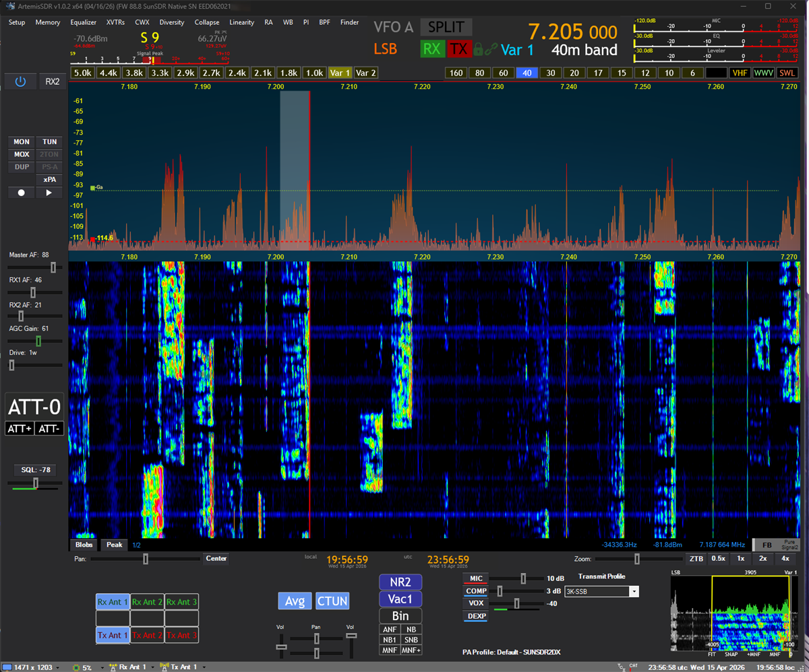

# ArtemisSDR

*Open source. Native protocol. Dedicated to Artemis II.*

**Current version: Beta v1.0.3**

⬇️ [**Download Latest Release**](https://github.com/kk68/ArtemisSDR/releases/latest)  ·  📘 [**Quick Start Guide**](START_HERE_SUNSDR2DX.md)  ·  📝 [What's new](https://github.com/kk68/ArtemisSDR/releases/latest)  ·  💬 [Discussions](https://github.com/kk68/ArtemisSDR/discussions)  ·  🐛 [Issues](https://github.com/kk68/ArtemisSDR/issues)

**An SDR host for the SunSDR2 DX — forked from Thetis.** ArtemisSDR is an additional option for SunSDR2 DX users who want the Thetis-lineage DSP stack — panadapter, filter set, NR/NB/notch toolkit, VAC routing, and the full feature set — running against the radio's native wire protocol. No ExpertSDR proxy, no bridge, no firmware changes.

ArtemisSDR is maintained by Kosta Kanchev (K0KOZ). It is a fork of [Thetis](https://github.com/ramdor/Thetis) by Richard Samphire (MW0LGE), which itself descends from OpenHPSDR (Doug Wigley, W5WC) and PowerSDR (FlexRadio Systems). Specialized for the SunSDR2 DX and released under GPL v2.

---

### ⚠️ Disclaimer

This project is **not affiliated with, endorsed by, sponsored by, or otherwise connected to Expert Electronics.** "SunSDR", "SunSDR2 DX", and "ExpertSDR" are trademarks of their respective owners; they appear in this project only to identify the hardware this software is compatible with.

The implementation is the product of independent, black-box reverse engineering — passive observation of UDP traffic between a genuine ExpertSDR instance and a lawfully-owned SunSDR2 DX radio. **No ExpertSDR code, binaries, firmware, artwork, or other Expert Electronics intellectual property is used.** The radio's firmware is not modified in any way; this is purely a host-side client that speaks the same wire protocol ExpertSDR does. Protocol-compatibility reverse engineering for interoperability is a well-established practice in open-source software (Samba, WINE, ReactOS) and is specifically recognized under 17 U.S.C. § 1201(f).

ArtemisSDR is **not affiliated with, endorsed by, or otherwise connected to NASA or the Artemis program.** The Artemis II reference is a personal dedication by the author honoring the mission; no NASA affiliation is implied or claimed.

Distributed free of charge under the GNU General Public License v2 for the amateur radio community.

---

## Contents

- [Who this is for](#who-this-is-for)
- [What works](#what-works)
- [Current limitations](#current-limitations)
- [Privacy & network activity](#privacy--network-activity)
- [Getting started](#getting-started)
- [TX power calibration per band](#tx-power-calibration-per-band)
- [Troubleshooting](#troubleshooting)
- [Building from source](#building-from-source)
- [For contributors](#for-contributors)
- [License](#license)
- [Acknowledgments](#acknowledgments)

## Who this is for

You'll get the most out of this fork if:

- You own a **SunSDR2 DX** and want to use it with ArtemisSDR instead of (or alongside) ExpertSDR.
- You're comfortable building a Visual Studio project once. There's no pre-built installer yet.
- You have an external wattmeter and dummy load handy for the first TX bring-up on each band.
- You operate with normal amateur-radio discipline — we transmit into dummy loads for testing, not onto the air.

If you're brand new to SDR or to your radio, work through your radio's official documentation first. ArtemisSDR inherits its UI from Thetis, so any beginner tutorial explaining the Thetis interface applies directly here. This fork assumes you already understand what panadapters, VAC, and a drive slider do.

## What works

**Receive**

- RX1 with panadapter, waterfall, and audio on every mode ArtemisSDR supports
- RX2 as an independent second receiver with its own VFO B and audio path
- RX antenna selection (primary / auxiliary inputs)
- Live firmware-version and serial-number display in the title bar and `Setup → H/W Select`

**Transmit**

- MOX and TUNE via native wire protocol, reliable across consecutive attempts
- TUNE in every mode lands on the dial frequency — SSB, CW, AM, FM
- Voice SSB, AM, CW, and digital modes transmit on the correct sideband/carrier
- External PA (`xPA`) control during MOX and TUNE
- TX power **calibrated linearly on 40 m**: drive slider in watts maps to actual RF within ~1 W across 10–90 W
- TX antenna selection (primary / auxiliary outputs)
- AM Carrier Level setting wired through to the WDSP AM modulator

**General**

- Power-on to RX in ~1-1.5 seconds, comparable to ExpertSDR3
- Sub-second band switching — native protocol, no session teardown
- The full WDSP-based DSP stack inherited from Thetis: NR, NR4, ANF, NB/NB2, EQ, CESSB, CFC, notch, compander — everything works
- VAC audio routing (CABLE, VoiceMeeter, etc.) works on both RX and TX
- Clean Power off / Power on cycling from the ArtemisSDR UI
- Proper `PA Gain By Band` and per-drive offsets integration — calibrate the way you'd calibrate any Thetis-family radio

## Current limitations

Honest list of what's partially done or missing. None of these prevent normal operation; they're items to be aware of.

| Area | Status |
| --- | --- |
| **TX power calibration** | 40 m is locked. Other bands fall back to the 40 m curve — expect a few dB deviation until separately calibrated. |
| **`Fwd Pwr` meter** | Not yet wired to the SunSDR telemetry stream. Use an external wattmeter for now. |
| **PS-A, 2-TONE, DUP** | Grayed out on SunSDR. These depend on a feedback-loop path the radio doesn't expose; not a bug, a hardware-architecture constraint. |
| **Diversity mode** | Unsupported. RX2 follows RX1's antenna selection; no independent per-receiver antenna path has been found. |
| **MON / DUP audio routing** | Not fully settled during TX. If you need to monitor your own transmission, a second receiver is the reliable path. |
| **Occasional post-TX raspy audio** | Intermittent; cycling VAC clears it. Tracked as a polish item. |

## Privacy & network activity

ArtemisSDR is a local-network SDR host; it does not include telemetry, crash reporting, analytics, or any identifying phone-home. That said, it does make the following outbound connections so you know what to expect:

- **Version check on launch and when opening About** — fetches `https://raw.githubusercontent.com/kk68/ArtemisSDR/refs/heads/main/version.json` (a small JSON file with the latest release version). The GitHub HTTPS connection itself logs a standard IP request log at GitHub's infrastructure. No identifying payload is sent.
- **Skin-server list refresh** (inherited from upstream Thetis) — fetches `https://raw.githubusercontent.com/ramdor/Thetis/master/skin_servers.json` to resolve the list of servers from which skin packs can be downloaded. Only fetched when the user navigates to the skin manager UI.
- **Optional skin downloads** — if the user chooses to download a skin pack, it is fetched from whichever third-party server the skin manager resolves. No data is sent other than the standard HTTPS request.

On the local filesystem, ArtemisSDR creates and writes to:

- `%AppData%\ArtemisSDR\` — all persistent state: the settings database, per-instance logs (`ErrorLog.txt` and, if the user enables native diagnostic logging, `sunsdr_debug.log`), installed skins, memory and DX memory lists, and the UI window-layout cache. Nothing in this folder is transmitted anywhere by ArtemisSDR.
- Audio recording (opt-in, Setup → Audio → Recording) — WAV files land in `My Music\ArtemisSDR\` when the user explicitly records.
- Windows Firewall — the installer registers inbound rules for `ArtemisSDR.exe` (TCP and UDP) so the radio can initiate connections to the host. These are standard rules named "ArtemisSDR (TCP In)" / "ArtemisSDR (UDP In)" and can be audited in Windows Defender Firewall at any time.
- Windows Registry — install state lives under `HKLM\Software\ArtemisSDR\` (installer-owned) and cmASIO settings under `HKLM\SOFTWARE\ArtemisSDR\` (app-owned). Uninstalling removes the installer-owned keys.

ArtemisSDR does **not** send any data to the author (K0KOZ), to kk68, or to any third party — including when an error occurs. If you hit a bug and want to send a log, you have to attach `ErrorLog.txt` to an email or GitHub issue yourself; the app will never do it for you.

## Getting started

A complete step-by-step walkthrough lives in **[START_HERE_SUNSDR2DX.md](START_HERE_SUNSDR2DX.md)** — covers the Windows/network prerequisites, radio discovery, first-run setup, audio routing, and first TX. Read that one after you have a build.

Short version:

1. Build the solution (see [Building from source](#building-from-source) below).
2. Launch ArtemisSDR, pick **SunSDR2DX** as the hardware model, confirm **"Use watts on Drive/Tune slider"** is on in `Setup → General`.
3. Connect the radio, hit Power in ArtemisSDR, verify you're receiving.
4. Dummy load, 25 W drive, LSB TUNE on 40 m → confirm ~25 W on an external wattmeter.

## Troubleshooting

**ArtemisSDR doesn't see the radio.** First — auto-discovery does **not** work for the SunSDR2 DX. You must add the radio manually via `Setup → H/W Select → tick Advanced → Custom → fill in Via NIC + Radio IP`. See [START_HERE_SUNSDR2DX.md → Step 3](START_HERE_SUNSDR2DX.md#3-open-the-hardware-network-page-and-add-your-radio-manually) for screenshots and field-by-field instructions. Then verify the radio's IP is reachable (`ping <your-radio-IP>` — e.g. `ping 192.168.1.50`, substituting your radio's actual address) from the host machine. Make sure no other ExpertSDR instance is running anywhere on the network — the radio's control port is exclusive. The most common mistake after a manual add is picking the wrong **Via NIC** — it must be the adapter on the same subnet as the radio.

**No TX RF output.** Confirm `Setup → General → Use watts on Drive/Tune slider` is on. Confirm the drive slider isn't at zero. Confirm you're in a transmittable mode (not SPEC or DRM).

**Audio is garbled or robotic after a TX cycle.** Cycle VAC off and on from its sidebar (the "Enable VAC" checkbox). This clears a resampler transient that occasionally lingers after certain TX → RX transitions.

**Signals on the panadapter look unusually wide, audio quality is off, right after startup.** Rare, but seen. Power-cycle ArtemisSDR (Power off → Power on) to re-initialize the RX DSP.

**`Fwd Pwr` meter reads zero.** Expected for now. The meter isn't wired to SunSDR forward-power telemetry yet — use an external wattmeter. This is the next planned feature.

## Building from source

Source-only distribution for now. Build locally with Visual Studio 2022.

**Prerequisites**

- Windows 10 or 11, x64
- Visual Studio 2022 with the **C++ desktop development** workload
- The **v143** platform toolset installed

**Steps**

1. Clone this repository.
2. Open `Project Files/Source/ArtemisSDR.sln`.
3. Configuration: **Debug | x64** (Release | x64 also builds).
4. Build → Rebuild Solution.
5. Run the resulting `ArtemisSDR.exe`.

## For contributors

Protocol implementation lives in `Project Files/Source/ChannelMaster/sunsdr.c` and `sunsdr.h`. These are original work authored for ArtemisSDR via black-box reverse engineering — no external source code referenced.

Deeper architecture notes, opcode tables, TX power-calibration design, VAC underflow root-cause analysis, and the file-by-file changelog are in **[TECHNICAL.md](TECHNICAL.md)**.

Protocol-level reverse-engineering documentation is maintained in a separate private repository. If you're contributing at the wire-protocol level and need access, reach out directly.

Contributions welcome: bug fixes, per-band calibration data, UI polish, completion of the open limitations. Pull requests against `feature/sunsdr2dx` please.

## License

This fork inherits the **GNU General Public License, version 2** from upstream Thetis. See [LICENSE](LICENSE) for full terms. All source code must remain under GPL v2; any redistributed modifications must also be under GPL v2 and must provide full source.

The SunSDR native protocol implementation (`sunsdr.c`, `sunsdr.h`) is original work and is licensed the same way. It is derived from independent black-box reverse engineering of lawfully-owned hardware — no Expert Electronics code, binaries, firmware, or other intellectual property was used.

**Dual-licensing statements** — both present in the repo:

- [LICENSE-DUAL-LICENSING](LICENSE-DUAL-LICENSING) — Richard Samphire (MW0LGE) reserves the right to also offer his own Thetis contributions under different licensing terms, in addition to GPL v2.
- [LICENSE-DUAL-LICENSING-K0KOZ](LICENSE-DUAL-LICENSING-K0KOZ) — Kosta Kanchev (K0KOZ) makes the corresponding reservation for his own original ArtemisSDR contributions (SunSDR2 DX native protocol, rebrand, integration work), also in addition to GPL v2.

Neither dual-licensing statement restricts anyone's rights under GPL v2. ArtemisSDR in this repository is and will remain freely distributable under GPL v2.

## Acknowledgments

- **Thetis** — Richard Samphire (MW0LGE) and the Thetis contributor community. Upstream: [ramdor/Thetis](https://github.com/ramdor/Thetis).
- **PowerSDR** — FlexRadio Systems and Doug Wigley, the ancestor of this whole lineage.
- **WDSP** — Warren Pratt (NR0V) and contributors. The DSP engine at the heart of everything.
- The amateur radio community, for decades of making radios and software talk to each other.

No affiliation with Expert Electronics is implied or claimed.

73!
