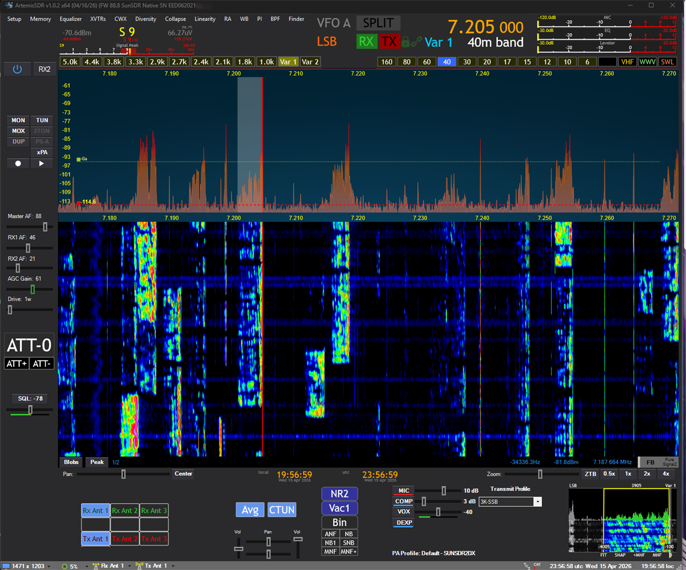

# ArtemisSDR

*Open source. Native protocol. Dedicated to Artemis II.*

**Current version: v2.1.9**

⬇️ [**Download Latest Release**](https://github.com/kk68/ArtemisSDR/releases/latest)  ·  📘 [**Quick Start Guide**](START_HERE.md)  ·  📝 [What's new](https://github.com/kk68/ArtemisSDR/releases/latest)  ·  💬 [Discussions](https://github.com/kk68/ArtemisSDR/discussions)  ·  🐛 [Issues](https://github.com/kk68/ArtemisSDR/issues)

**An SDR host for the SunSDR2 family (DX + PRO) — forked from Thetis.** ArtemisSDR is an additional option for SunSDR2 DX and PRO users who want the Thetis-lineage DSP stack — panadapter, filter set, NR/NB/notch toolkit, VAC routing, and the full feature set — running against the radio's native wire protocol. No ExpertSDR proxy, no bridge, no firmware changes.

ArtemisSDR is maintained by Kosta Kanchev (K0KOZ). It is a fork of [Thetis](https://github.com/ramdor/Thetis) by Richard Samphire (MW0LGE), which itself descends from OpenHPSDR (Doug Wigley, W5WC) and PowerSDR (FlexRadio Systems). Specialized for the SunSDR2 family (DX + PRO) and released under GPL v2.

### What's new in v2.1.9

**SunSDR2 PRO RX lifted to native 312.5 kHz — done properly this time (issue #47 / #46).** After v2.1.7's PRO native-rate attempt broke RX audio and was reverted in v2.1.8, Jeff N0GQ picked up the trail on his own bench with a real SunSDR2 PRO, captured ExpertSDR3 stepping the radio through all four IQ rates, and posted the ground truth to issue #47. His finding: v2.1.7 wrote to the wrong field entirely. The eight per-channel `0x14` words in the PRO state-sync template are **fixed formatting** on the PRO — they carry the same value at every rate. The actual rate selector is a `uint16 LE` at STATE_SYNC bytes 56 AND 58 (redundant copies), and Jeff's capture confirmed the field cycled 0→1→2→3→0 in exact lockstep as EESDR3 walked the rate 39→78→156→312→39 kHz. Values: `0 = 39062.5 Hz`, `1 = 78125`, `2 = 156250`, `3 = 312500`.

v2.1.9 writes index 3 at STATE_SYNC bytes 56/58, leaves the eight `0x14` formatting words alone, and bumps `sunsdr_profile_pro.rxNativeRate` to 312500.0. With that single rate value flipped, the existing `sunsdr_rx_uses_native_router_rate()` dispatch fork automatically routes PRO to the same native-312500 xrouter path the DX has been on since v2.0.8 — no resampler, no upsample stage, same code path as DX. Panadapter span widens from ~20 kHz (v2.1.8) to ~150 kHz (matching what DX and EESDR3 provide), and the whole downstream WDSP chain is a proven one.

**Full credit to Jeff N0GQ** for the wire captures, the protocol decode, and independently verifying it works on his own PRO client (FT8 decoded cleanly at 312500). His writeup — which also covers reference clock (`0x1D`), telemetry field map, TX bring-up sequence, RX2 STATE_SYNC field, DDC offset, and other PRO findings — lives at [https://github.com/jfrancis42/solsdr/blob/main/ARTEMISSDR.md](https://github.com/jfrancis42/solsdr/blob/main/ARTEMISSDR.md). Those additional findings are noted for future Artemis releases and are NOT in scope for v2.1.9; this release does one thing and one thing only.

**Rate context for both radios.** ArtemisSDR feeds WDSP at 312500 Hz native on both DX and PRO after v2.1.9. There is no runtime resampler on the shipping RX path for either radio — the IQ goes wire → xrouter → WDSP at 312500. WDSP handles everything downstream to the audio sample rate internally. The 39062.5 → 384 kHz upsample helper is retained in source as an unreachable fallback but is not executed at 312500.

**PRO testers — please install and confirm.** Bernie F6Bernie, Jim W4JEA, Pedro EA5CCY, SQ5OMO, Jeff N0GQ — anyone with a PRO on their bench, please install v2.1.9 and confirm the wider panadapter span and clean RX audio at 312500. If anything misbehaves the revert is one commit back to v2.1.8. No DX behaviour changes — DX code path is byte-for-byte unchanged from v2.1.8.

### What was new in v2.1.8

**Hotfix release: reverts the v2.1.7 PRO native-rate change (issue #47).** The v2.1.7 attempt to lift SunSDR2 PRO RX from 39,062.5 Hz to 312,500 Hz by reusing the DX state-sync rate code (`0x32`) broke RX audio on multiple PRO testers — Bernie F6Bernie, Jim W4JEA, Pedro EA5CCY, and SQ5OMO all reported no audio, slow/garbled panadapter, or program crashes after upgrading. Pedro's observation that "the sample rate it's ok but I haven't sound" was the diagnostic clue: the radio accepted the rate-set command (spectrum rendered wider) but downstream audio could not keep up. The most likely explanation is that the rate-code lookup table differs between DX and PRO — the `0x32` value that produces 312500 Hz on the DX appears to command a substantially higher rate on the PRO. We don't have a verified wire capture of EESDR3 commanding the PRO at 312500 to ground-truth the correct rate code, so the safe path is to put the PRO back where it was and try again later with capture data in hand.

v2.1.8 restores the SunSDR2 PRO to the v2.1.6 baseline: native 39,062.5 Hz IQ with the 39062.5 → 384 kHz upsample stage feeding WDSP. Panadapter span is back to ~20 kHz around the tuned frequency (narrower than EESDR3 at the higher rates, but RX audio works — which is the priority). Per-band TX power calibration from v2.1.4/v2.1.6, MON-button gate, and all other PRO support remain in place.

**Apologies to PRO testers** for the broken v2.1.7. The fix-in-public model has a real cost when there's no PRO on the development bench to validate against — v2.1.7 shipped with an explicit "best effort" caveat for exactly this reason, but the resulting friction was avoidable. Lifting the PRO rate properly will require a wire capture from a willing tester comparing EESDR3 PRO at 39062.5 vs 312500 vs the higher rates so we can decode the actual rate-code byte the radio expects.

**The cmASIO Setup UX fix and the meter skin-path fix from v2.1.7 are unchanged and remain shipped.** Those were independent of the PRO rate change and are working as intended.

### What was new in v2.1.7

Three independent fixes bundled. Two of them (PRO native rate, meter skin path) touch PRO-side behaviour we couldn't fully validate locally because there's no SunSDR2 PRO on the development bench. **PRO users — please install, test, and report back on issue #46 (sample rate) and issue #45 (meters) if anything misbehaves.** Reverts are a single commit each; nothing in this release is irreversible.

**SunSDR2 PRO RX lifted to native 312.5 kHz (issue #46).** Previously the PRO was hard-locked at the lowest of the four IQ rates the radio supports (39,062.5 Hz), with a 39062.5 → 384 kHz upsample stage feeding WDSP. The panadapter span was capped at ~20 kHz when the hardware can do ~150 kHz. Per Expert Electronics' product page and Adam Farson's review, PRO supports the same four IQ rates as the DX (39062.5 / 78125 / 156250 / 312500), and Jim W4JEA's EESDR3 screenshot on issue #46 confirmed the radio runs at 312500 Hz on the same hardware. The fix lifts PRO to 312500 Hz native (matching DX): swaps the 8 × `0x14` per-channel rate codes in the PRO state-sync wire template for `0x32` (the rate code DX uses today), changes the PRO profile's `rxNativeRate` to 312500.0, and the upsample stage is bypassed automatically via the existing native-router gate. The old 39062.5 → 384 kHz path is left in the source as a dormant fallback in case it's needed for a future model. **No DX behaviour changes** — DX path is byte-for-byte unchanged.

**Honest caveat on the PRO change:** we don't have a PRO on the bench, so this fix is best-effort based on (a) the protocol family being identical between DX and PRO, (b) the wire-template structure being symmetric across the two state-sync packets, and (c) the four-rate spec being documented by Expert. If your PRO comes up silent or distorted after upgrading to v2.1.7, please open an issue immediately and we'll revert. Revert is one commit.

**Meter skin/asset path was still pointing at upstream OpenHPSDR (issue #45).** MeterManager.cs:391 hardcoded `%APPDATA%\OpenHPSDR\` as the root for skin + meter asset lookup — a leftover from the upstream Thetis path that never got renamed when Artemis split off. Every other path bootstrap in the app uses `%APPDATA%\ArtemisSDR\` correctly, but MeterManager was missed. As a result, even though `default-skin.zip` correctly extracts OE3IDE-TheBlue (with all the standard meter assets — `cross-needle.png`, `eye-bezel.png`, `ananMM-bg*.png`, the rotator backgrounds) into `%APPDATA%\ArtemisSDR\Skins\` on first launch, the meter renderer was hunting in a non-existent OpenHPSDR folder. Anything more elaborate than a bar meter — cross-needle, eye-bezel, rotators — rendered as bare scale text + tick lines with no dial-face background. Bernie F6Bernie's #45 symptom (meter container broken on first install, fixed only after installing Thetis once) matched exactly: Thetis's `MeterSkinInstaller` populates `%APPDATA%\OpenHPSDR\`, which then accidentally satisfied Artemis's wrong lookup path. **Fresh Artemis installs after v2.1.7 get working cross-meter / eye-bezel / rotator meters out of the box** — no Thetis side-trip required.

**cmASIO Setup tab — device + I/O pair dropdowns now unlocked while running; Disable button gives visible feedback.** The cmASIO tab follows a "queue change, apply on restart" model (see the "Settings updated. Restart to take effect." label). Earlier code disabled the device dropdown and the in/out pair selectors whenever cmASIO was already active, preventing users from queuing a different device or channel set for the next session. There was no architectural reason for that lock — pickering a different device just updates the registry for the next launch; it doesn't disturb the running cmASIO. Additionally, the Disable button previously wrote `""` to the ASIO driver name with zero on-screen feedback (users clicked Disable and the form looked unchanged), making it feel like the button was inert. Both fixed: dropdowns are always enabled, Disable clears the current-device label and greys out the per-device controls so the queued-disable state is visible immediately.

**No DX behaviour changes outside the cmASIO UX improvement above** (which affects all SunSDR users on cmASIO).

### What was new in v2.1.6

**SunSDR2 PRO TX power calibration — refined two-point fit + 6 m entry (issue #39).** v2.1.4 shipped a single-point-per-band PRO calibration table from Bernie F6Bernie's 10 W measurements. Bernie then ran a follow-up at 5 W and 15 W per band — a true two-point sweep — plus 6 m which the v2.1.4 table didn't have at all and was falling through to the 20 m default. v2.1.6 fits both K and C per band from the two data points so the curve passes through Bernie's measurements at 5 W and 15 W exactly:

| Band | Real 5 W → v2.1.5 | Real 15 W → v2.1.5 | v2.1.6 expectation |
|------|-------------------|---------------------|--------------------|
| 160m | 7 W | 15 W | exact at 5 W and 15 W |
| 80m | 7 W | 13 W | exact |
| 60m | 7 W | 14 W | exact |
| 40m | 8 W | 15 W | exact |
| 30m | 7 W | 13 W | exact |
| 20m | 7 W | 14 W | exact |
| 17m | 7 W | 13 W | exact |
| 15m | 7 W | 12 W (real 13 W) | exact |
| 12m | 7 W | 14 W | exact |
| 10m | 6 W | 13 W | exact |
| **6m (new)** | **12 W (real 5 W)** | **23 W (real 11 W)** | **exact** — was 2× over before |

**Caveat — still a two-point fit.** The cal lands within ~0.5 W on Bernie's test points but may deviate at higher powers (50 W+) where most HF QRO operation actually happens. **PRO testers — please post (Artemis displayed, real measured) pairs at 25 / 50 / 75 / 100 W per band on issue #39 so the curve can be tightened across the full operating range.**

**No DX behaviour changes.** The DX cal table is byte-for-byte unchanged. PRO uses its own branch in `GetSunsdrPwrCal`.

**Thanks** to Bernie F6Bernie for running the second batch of measurements before going QRT for the day.

**No DX/PRO behaviour changes outside the PRO power table.** Includes the v2.1.5 VAC AF restoration, the v2.1.4 MON gate fix, the v2.1.3 TCI decoupling, the v2.1.2 PRO Power-On fix, and all v2.1.1 TX cleanup.

### What was new in v2.1.5

**RX AF slider now drives VAC1 / VAC2 volume again (issues #40 / #41).** v2.1.3 decoupled VAC and TCI audio from the AF slider to fix Scott VK4SHG's complaint on issue #40 — digital decoders were unusable unless AF sat near 50%. Architecturally that was the right move for TCI, but it broke the most common workflow on the RX side: VAC users (the long-running default since OpenHPSDR / Thetis) lost their primary volume control. RobbiePh / EI2IP on issue #40 and ea5ccy on issue #41 reported the regression within hours of v2.1.3 going out.

**v2.1.5 puts VAC volume back on the AF slider while keeping TCI at fixed DSP level.** The fix lives at the per-VAC-mixer level: the AF / volume slider now scales the VAC's RX input gain (`SetIVACafgain` on the VAC mixer's input 0) in addition to the speaker mixer it already drove in v2.1.3. WDSP's RX panel gain stays pinned at 1.0, so TCI — which taps the audio earlier in the pipeline (before the per-VAC mixer) — is unaffected. Decoders on TCI keep working at any AF setting.

**Composes cleanly with Setup → VAC RX Gain.** The two scales multiply at the mixer (`tvol = vac_rx_scale × af_gain`). Use AF for normal volume swings, VAC RX Gain for set-once trim. Same as it felt before v2.1.3.

| Path | v2.1.4 (broken) | v2.1.5 |
|---|---|---|
| Speaker | AF-scaled ✓ | AF-scaled ✓ |
| **VAC1 / VAC2 RX** | full level (broke) | **AF-scaled** ✓ |
| TCI RX | full level ✓ | full level ✓ |
| WAV recorder | full level | full level |

**Initialization gotcha handled.** When VAC is enabled (or re-enabled), Artemis now syncs the VAC mixer's RX gain to the current AF slider position immediately, so the volume is correct on first connect — not just after the user nudges the slider once.

**Minor known limitation.** Multi-subRx-into-VAC users: only the main RX AF slider drives the VAC mixer. The SubRx slider scales the speaker correctly but doesn't independently scale the SubRx contribution to VAC. Rare workflow; documented inline in `radio.cs`.

**Thanks** to RobbiePh / EI2IP and ea5ccy for the fast regression reports, and to Scott VK4SHG for the original architectural feedback that's still preserved for TCI.

**No DX/PRO behaviour changes outside the AF/VAC routing described above.** Includes the v2.1.4 PRO power-calibration table, the v2.1.4 MON gate fix, the v2.1.3 TCI decoupling, the v2.1.2 PRO Power-On fix, and all v2.1.1 TX cleanup.

### What was new in v2.1.4

**SunSDR2 PRO TX power calibration — first proper per-band table (issue #39).** PRO testers reported the Artemis TX meter reading absurd numbers (e.g. 327 W on 7 MHz when the radio was actually putting out 10 W). Root cause: the per-band cal table was anchored on **SunSDR2 DX measurements only**, and the PRO's directional coupler has a coupling factor roughly 25-50× weaker than the DX, so the same raw ADC reading translated into ~25-50× more displayed power. Bernie F6Bernie did the legwork and sent measurements at 10 W actual on every HF band, top to bottom — that data is now baked in as a PRO-specific table.

| Band | Real | DX cal showed | PRO cal will show |
|------|------|---------------|-------------------|
| 160m | 10 W | 420 W | ~10 W |
| 80m | 10 W | 371 W | ~10 W |
| 60m | 10 W | 330 W | ~10 W |
| 40m | 10 W | 250 W | ~10 W |
| 30m | 10 W | 360 W | ~10 W |
| 20m | 10 W | 420 W | ~10 W |
| 17m | 10 W | 388 W | ~10 W |
| 15m | 10 W | 480 W | ~10 W |
| 12m | 10 W | 502 W | ~10 W |
| 10m | 10 W | 480 W | ~10 W |

**This is a single-point cal per band.** The shape of the quadratic (zero-offset C) is held at the DX value, and only the slope coefficient K is corrected. That gives accurate readings near 10 W and approximately right readings across the lower-power range, but the curve will probably drift at higher powers (50-100 W) until we have multi-point sweeps. **PRO testers — please post (Artemis displayed, actual measured) pairs at 25 / 50 / 75 / 100 W per band on issue #39 so we can tighten this.**

**No DX behaviour changes.** The DX cal table is byte-for-byte unchanged. PRO uses its own branch in `GetSunsdrPwrCal`; DX uses the existing branch (40m + 20m measured by LP-500, default-fallback for others).

**MON button gate now covers PRO too (issue #39).** On the SunSDR family the TX-monitor audio path has two long-standing bugs (silent through VAC, robotic through cmASIO), so MON is intentionally hard-disabled while we root-cause the routing. The gate in `chkMON_CheckedChanged` was checking only `SUNSDR2DX` — same DX-vs-PRO equality bug pattern as v2.1.2's firmware probe — so on PRO the button could be re-enabled by mode-switch handlers and clicked, arming `Audio.MON` and routing broken audio. Expanded to the SunSDR family. The 6 mode-switch sites that re-enabled MON are now also SunSDR-aware so the button doesn't visually toggle clickable / non-clickable as the user changes modes.

**Thanks** to Bernie F6Bernie for the careful measurements, screenshots, and patient testing on issue #39.

**No DX/PRO behaviour changes outside the items above.** RX path, TX path, panadapter, waterfall, mode handling, cmASIO, VAC routing, hardware PTT — all unchanged from v2.1.3 (which itself includes the v2.1.2 PRO Power-On fix and the v2.1.1 TX cleanup).

### What was new in v2.1.3

**VAC / TCI RX audio decoupled from RX AF slider (issue #40).** Reported by **Scott VK4SHG** and reproduced locally with JTDX: digital-mode decoders (Decodium, JTDX, FLDIGI, WSJT-X via VAC1, TCI clients) only worked when the RX1 AF slider was somewhere near 50%. Drop AF to listen quietly — decoders stopped decoding. Push AF up to listen loudly — decoders saw clipped audio.

Root cause: the AF / volume slider was wired straight into WDSP's RXA panel gain (`SetRXAPanelGain1`), which scales the audio inside WDSP's pipeline *before* the point where VAC, TCI and the WAV recorder tap it. So the operator's listening volume was effectively the master input gain for every digital downstream consumer.

**The fix** moves the AF slider to the speaker mixer's per-input gain (`SetAAudioMixVol` on cmaster's audio mixer 0) and pins WDSP's RXA panel gain at 1.0. Net effect:

- **VAC1, VAC2, TCI RX, and the WAV recorder** now receive a fixed DSP-level audio stream regardless of where the AF slider sits. Set AF for what you want to hear; set VAC RX Gain (Setup → VAC → RX Gain) for what your decoder hears. They finally do separate things.
- **Speaker / headphone path** is unchanged in feel — the AF slider still controls listening volume the way it always has, just applied at the mixer instead of inside WDSP.
- **WAV recordings** are now at full DSP level regardless of AF (previously the recorder used an inverse-gain compensation to undo the AF coupling — that compensation is no longer needed and has been removed).
- **TX path, mode handling, panadapter, waterfall** — completely unchanged.

**Re-tuning note for existing digital-mode users.** If you've been running with VAC1 RX Gain set to compensate for AF=50%, your decoder will see roughly 2× the audio level it used to. Lower VAC1 RX Gain by ~6 dB once and you're done.

**Side effect — "Mute will mute VAC1" option is now inert.** That option used to silence VAC by zeroing the WDSP gain, leveraging the same coupling we've just removed. Users who want VAC silenced should toggle the VAC1 / VAC2 enable directly. May be reworked in a future release if there's demand.

Thanks to **Scott VK4SHG** for the careful architectural write-up that led directly to the fix.

**No DX/PRO behaviour changes outside the RX audio routing described above.** Includes the v2.1.2 PRO Power-On fix and all v2.1.1 TX cleanup.

### What was new in v2.1.2

**Critical PRO Power-On fix (issue #38).** SunSDR2 PRO users on v2.1.0 / v2.1.1 saw "No radio detected" when clicking Power-On — even though discovery correctly listed the radio in H/W Select. Root cause: the pre-flight reachability check (added in v2.0.16) hardcoded the DX family byte (`0x32`) in its UDP firmware-manager probe. PRO radios use family byte `0x01` and silently ignored the wrong-family probe, so the pre-flight always timed out for PRO.

The fix mirrors what the native sunsdr.c side already does: send the probe for every known SunSDR2 family byte (DX `0x32`, PRO `0x01`, plus four sibling reservations matching the discovery code's multi-family probe), and accept any reply. The radio replies to the one matching its family; the rest go ignored harmlessly.

Thanks to **Jim W4JEA** and **Bernie F6Bernie** for catching this and to **Dmitry @Tort1k558** for the PRO testing relay.

**No DX behaviour changes.** DX still gets its `0x32` reply on the first probe; the additional family bytes are sent but ignored by the DX. RX, TX, panadapter, waterfall, all v2.1.1 TX cleanup work — unchanged.

### What was new in v2.1.1

**TX wire-encoder cleanup pass.** A focused round of bench-validated changes to the SunSDR TX path that pushes close-in spurs (visible at ±2-15 kHz from carrier on a separate receiver) substantially down. Mic-side voice MOX in particular shows visibly cleaner spectrum. Five coordinated changes:

- **Resampler upgraded from boxcar to 257-tap Hamming-windowed sinc FIR.** The prior boxcar averager (192k → 39 062.5 Hz wire decimation) had only ~13 dB stopband attenuation. The new FIR is tightened to a 4 kHz baseband cutoff with ~52 dB stopband from ~5.2 kHz, doubling as a brick-wall baseband cleanup filter that suppresses out-of-band content above the SSB voice intelligibility band.
- **Mode-aware IqGain.** TUNE keeps its 1.167 multiplier (cal anchors locked to this gain), but voice MOX drops to 1.0. Voice peaks now top out at ~0.90 instead of pushing past 1.0 — eliminating routine quantizer hard-clipping that was generating IMD3/IMD5 between voice frequency components on multi-tone speech content.
- **Soft-knee tanh envelope limiter** (replaces the prior hard envelope clamp; HF and VHF). The old hard clamp at |IQ|=1.0 was fine for steady-state TUNE but acted as a brick-wall limiter on voice transients, generating audible IMD on its own. The new C^∞-smooth tanh transition above 0.97 compresses peaks gradually with continuous derivative — no abrupt limiting, no IMD generation from the limiter itself.
- **HF envelope clamp generalised from VHF-only.** The phase-preserving envelope clamp at |IQ|>1.0 now applies to all bands, not just VHF. Catches the rare cases where the soft-knee asymptote rounds slightly above the boundary.
- **TX peak-distribution histogram in `TX_ATTEMPT_END` debug log.** New `peakHist=A/B/C/D/E/F` field tracks how many post-IqGain samples land in each peak bucket per TX session. Diagnostic-only, gated on `SUNSDR_DEBUG_LOG_ENABLED`.

**On-air result:** voice MOX spurs from quantizer hard-clipping (3rd/5th-harmonic IMD between voice frequencies) are gone. Spurs at >4 kHz from carrier are suppressed by the new baseband filter. The remaining residual at 2-3 kHz from carrier on the opposite-sideband side is fundamental WDSP TXA modulator imbalance — the canonical PS-A use case, queued for the LP-500 sense-port retrofit work.

**Voice character note:** the 4 kHz baseband cutoff lightly attenuates audio content above 3 kHz. Standard SSB voice (200-3000 Hz intelligibility band) is unaffected; ESSB enthusiasts running 4-5 kHz audio profiles may notice a slightly darker high end. The wider 18 kHz cutoff can be restored via `SUNSDR_TX_FIR_CUTOFF_HZ` if needed.

**No DX/PRO behaviour changes outside the TX wire encoder.** RX path, panadapter, mode/filter/antenna handling, cmASIO, VAC, PA control, hardware PTT — all unchanged from v2.1.0.

### What was new in v2.1.0

**Native SunSDR2 PRO support.** ArtemisSDR now drives both SunSDR2 DX *and* SunSDR2 PRO from the same release. Built on Dmitry @Tort1k558's contribution PR #30 — first external community contribution to ArtemisSDR. Discovery, model auto-detection, profile-table dispatch, and the bring-up paths are all in place. PRO support is in **preview**: validated on a SunSDR2 DX (no DX regressions), but the PRO-side bring-up needs more on-air time. PRO users running v2.1.0 are encouraged to file issues at https://github.com/kk68/ArtemisSDR/issues.

**Per-band TX power calibration.** SunSDR2 DX TX meter is now calibrated on a per-band basis (40 m: K=0.00343 / C=38; 20 m and other bands: K=0.00412 / C=33). The earlier single-curve fit was accurate on 20 m and over-reading on 40 m by up to 28 W. Bands beyond 40/20 default to the 20 m curve and will get their own measurements as users send LP-500 sweeps.

**v2.1.0 also includes everything from v2.0.10 → v2.0.16:**

- **v2.0.16:** "No radio detected" pre-flight check on Power-On — fail-fast in 2 s instead of 9 s of silent timeouts.
- **v2.0.15:** WDSP analyzer buffer-overflow fix (panadapter "replay" drift); ATT-on-TX hard-disabled on SunSDR (S-ATT 31 cosmetic fix).
- **v2.0.14:** ADC-Overload (OVL) indicator in status bar; MON button disabled (parked TX-monitor routing issue).
- **v2.0.13:** cmASIO restored under Setup → Audio for SunSDR2 DX.
- **v2.0.12:** Cold-start robotic-audio bug class CLOSED + matching exit-crash root cause.
- **v2.0.11:** Recording fix + silent-startup fix + ATT-on-power-on + exit hardening.
- **v2.0.10:** ATT recovery after TX + crash-free startup + clean close.

If you've been running v2.0.16, the only new things you'll notice are the per-band power meter accuracy and (on PRO) the radio actually working. DX users: no behavioural changes from v2.0.16 expected.

**Credits:** First external contributor to ArtemisSDR — @Tort1k558 (Dmitry, PR #30). Welcome aboard.

**Past releases:** see [GitHub Releases](https://github.com/kk68/ArtemisSDR/releases) for full per-version notes (v2.0.10 → v2.0.16 are summarised in the v2.1.0 release).

### About cmASIO

cmASIO is a direct, low-latency ASIO output path (bypassing VAC + PortAudio) for users with an ASIO-capable interface (MOTU, RME, Focusrite, etc.). The cmASIO tab is under **Setup → Audio** and works with the SunSDR's 312.5 kHz native rate.

### Why cmASIO instead of VAC + ASIO?

VAC + ASIO and cmASIO both end up at the same ASIO driver, but the signal chains are very different:

| Path | Pipeline |
|---|---|
| **VAC + ASIO driver** (the `Driver: ASIO` option on the VAC1/VAC2 tab) | WDSP audio → VAC virtual cable → ring buffer → **PortAudio** → PortAudio's ASIO host wrapper → ASIO driver → hardware |
| **cmASIO** | WDSP audio → ChannelMaster → **native Steinberg ASIO SDK direct** → ASIO driver → hardware |

What you get with cmASIO that you don't get with VAC + ASIO:

- **Lower latency.** Two intermediate hops drop out of the signal chain (the VAC virtual-cable ring buffer and the PortAudio host wrapper). Useful for digital modes, contest operation, and any workflow where round-trip latency matters.
- **Cleaner signal path.** Direct Steinberg ASIO SDK calls instead of PortAudio's wrapper. Fewer places for a buffer-size or rate mismatch to creep in.
- **No VAC required for hardware audio out.** If your only goal is "RX audio out of my ASIO interface", cmASIO does it without needing VAC enabled at all. (You can still enable VAC for digital-mode software routing — just not on the same ASIO driver cmASIO is using.)

When **VAC + ASIO is the right choice instead:** if you need VAC to feed digital-mode software (WSJT-X, FLDIGI, N1MM Logger audio, etc.) AND you want that audio routed to your hardware, VAC + ASIO is the standard path. cmASIO replaces the *output to hardware* portion only.

### How to configure cmASIO

1. Open **Setup → Audio → cmASIO**.
2. Pick your ASIO device from **Available ASIO Device(s)**.
3. Choose your **IN pair** and **OUT pair** (channel pairs your interface exposes — e.g. `ch1 + 2`).
4. Pick **MIC source** (Left, Right, or Both).
5. Click **Make Active**. The "Current cmASIO Device" line will populate.
6. **Restart Artemis** — cmASIO initialises at startup and again automatically when the SunSDR locks in its 312.5 kHz native rate.
7. After restart you should see a small green **cm** icon in the bottom-right status bar. Audio routes directly to your ASIO interface.

**Important:**
- cmASIO and VAC cannot share the same ASIO driver simultaneously. If VAC1/VAC2 has the same ASIO driver enabled, disable VAC before activating cmASIO (or vice versa).
- The SunSDR has no on-radio audio codec, so the inherited "audio hardware in the radio will not be operable" warning on the cmASIO panel does not apply to SunSDR users.
- To stop using cmASIO: open the cmASIO tab and click **Disable**, then restart Artemis.

### Known issues — please read before filing a bug

- **Rare crash on application exit** (Windows reports `0xc0000374` heap corruption) tied to the panadapter / GPU driver disposal path may still occur on some systems. The crash is during shutdown — your settings, memories, and recordings are safe. No data loss.
- **MUT button on the front panel does not mute.** Long-standing inherited bug from upstream Thetis; predates ArtemisSDR. Use VAC mute or your audio device's mute as a workaround.
- **PS-A / 2-TONE / DUP** are grayed out — see the limitations table below; this is a hardware-architecture constraint of the SunSDR2 DX, not a bug.

---

### ⚠️ Disclaimer

This project is **not affiliated with, endorsed by, sponsored by, or otherwise connected to Expert Electronics.** "SunSDR", "SunSDR2 DX", "SunSDR2 PRO", and "ExpertSDR" are trademarks of their respective owners; they appear in this project only to identify the hardware this software is compatible with.

The implementation is the product of independent, black-box reverse engineering — passive observation of UDP traffic between a genuine ExpertSDR instance and a lawfully-owned SunSDR2 DX radio. **No ExpertSDR code, binaries, firmware, artwork, or other Expert Electronics intellectual property is used.** The radio's firmware is not modified in any way; this is purely a host-side client that speaks the same wire protocol ExpertSDR does. Protocol-compatibility reverse engineering for interoperability is a well-established practice in open-source software (Samba, WINE, ReactOS) and is specifically recognized under 17 U.S.C. § 1201(f).

ArtemisSDR is **not affiliated with, endorsed by, or otherwise connected to NASA or the Artemis program.** The Artemis II reference is a personal dedication by the author honoring the mission; no NASA affiliation is implied or claimed.

Distributed free of charge under the GNU General Public License v2 for the amateur radio community.

---

## Contents

- [Who this is for](#who-this-is-for)
- [What works](#what-works)
- [Current limitations](#current-limitations)
- [Strong-signal behavior, OVL, and "ghost" spurs](#strong-signal-behavior-ovl-and-ghost-spurs)
- [Privacy & network activity](#privacy--network-activity)
- [Getting started](#getting-started)
- [Troubleshooting](#troubleshooting)
- [Building from source](#building-from-source)
- [For contributors](#for-contributors)
- [License](#license)
- [Acknowledgments](#acknowledgments)

## Who this is for

You'll get the most out of this fork if:

- You own a **SunSDR2 DX** or **SunSDR2 PRO** and want to use it with ArtemisSDR instead of (or alongside) ExpertSDR.
- You're OK running a Windows MSI installer (or building from source — both are supported).
- You have an external wattmeter and dummy load handy for the first TX bring-up on each band.
- You operate with normal amateur-radio discipline — we transmit into dummy loads for testing, not onto the air.

If you're brand new to SDR or to your radio, work through your radio's official documentation first. ArtemisSDR inherits its UI from Thetis, so any beginner tutorial explaining the Thetis interface applies directly here. This fork assumes you already understand what panadapters, VAC, and a drive slider do.

## What works

**Receive**

- RX1 with panadapter, waterfall, and audio on every mode ArtemisSDR supports
- RX2 as an independent second receiver with its own VFO B and audio path
- RX antenna selection (primary / auxiliary inputs)
- Live firmware-version and serial-number display in the title bar and `Setup → H/W Select`
- **2m (VHF) RX** on the SunSDR2 DX VHF path — NFM, SSB, AM

**Transmit**

- MOX and TUNE via native wire protocol, reliable across consecutive attempts
- TUNE in every mode lands on the dial frequency — SSB, CW, AM, FM
- Voice SSB, AM, CW, and digital modes transmit on the correct sideband/carrier
- External PA (`xPA`) control during MOX and TUNE
- TX power **calibrated linearly on 40 m**: drive slider in watts maps to actual RF within ~1 W across 10–90 W
- **2m (VHF) TX** on NFM — on-dial, clean carrier, ~6 W at max drive matching the SunSDR2 DX 2m hardware spec. VHF wire-IQ amplitude is tuned to match EESDR3 byte-for-byte at drive max.
- **2m forward-power meter** — calibrated against the radio's 2m PA ADC (u16[3] at `0x1F/00`)
- TX antenna selection (primary / auxiliary outputs)
- AM Carrier Level setting wired through to the WDSP AM modulator

**Network & setup**

- **Native SunSDR2 (DX + PRO) auto-discovery** — `Setup → H/W Select → Discover` now finds the radio automatically. The manual `Custom` fallback remains for unusual network topologies (VPN, multi-NIC, routers that block UDP broadcast).
- Simplified Custom Radio dialog — field is `Radio IP` (no port), pre-fills with the previously configured IP.

**General**

- Power-on to RX in ~1-1.5 seconds, comparable to ExpertSDR3
- Sub-second band switching — native protocol, no session teardown
- Deterministic cold-start — explicit WDSP-ready gate closes the prior intermittent "AM-wide filter latch" race
- The full WDSP-based DSP stack inherited from Thetis: NR, NR4, ANF, NB/NB2, EQ, CESSB, CFC, notch, compander — everything works
- VAC audio routing (CABLE, VoiceMeeter, etc.) works on both RX and TX
- Clean Power off / Power on cycling from the ArtemisSDR UI
- Proper `PA Gain By Band` and per-drive offsets integration — calibrate the way you would in Thetis

## Current limitations

Honest list of what's partially done or missing. None of these prevent normal operation; they're items to be aware of.

| Area | Status |
| --- | --- |
| **TX power calibration** | 40 m is locked. 2m is calibrated against the radio's own 2m PA ADC. Other HF bands fall back to the 40 m curve — expect a few dB deviation until separately calibrated. |
| **`Fwd Pwr` meter** | Live and calibrated on HF and 2m. Reads from the radio's 0x1F telemetry. Other bands' absolute watt readings inherit the HF calibration curve. |
| **PS-A, 2-TONE, DUP** | Grayed out on SunSDR — the radio doesn't expose a feedback-loop path. Not a bug, a hardware-architecture constraint. The PS-A label area in the panadapter info strip is now repurposed as the ADC-Overload lamp. |
| **ADC overload + analog front-end IMD ("ghost" spurs)** | Hardware limit of the radio, not Artemis. ADC clipping is now flagged by the ADC-Overload lamp; smaller "ghost" spurs near a strong carrier are analog-domain mixer products that no software can remove. Same behavior reproduces on ExpertSDR3 against the same radio. Cure is to reduce front-end gain (ATT). See [Strong-signal behavior, OVL, and "ghost" spurs](#strong-signal-behavior-ovl-and-ghost-spurs). |
| **Diversity mode** | Unsupported. RX2 follows RX1's antenna selection; no independent per-receiver antenna path has been found. |
| **MON button** | Grayed in v2.0.14. Long-standing TX-monitor routing issue on SunSDR — silent through VAC, robotic through cmASIO. RF TX is unaffected; only local monitor playback. Use a second receiver if you need to monitor your own transmission until we re-enable MON in a future release. |
| **Occasional post-TX raspy audio** | Intermittent; cycling VAC clears it. Tracked as a polish item. |
| **Rare crash on app exit after band changes** | Heap corruption surfaces during teardown (`0xc0000374`). No data loss — settings, memories, and recordings are flushed atomically before exit. Under investigation. |
| **MUT button on the front panel** | Does not mute. Long-standing inherited bug from upstream Thetis; predates ArtemisSDR. Use VAC mute or the audio device mute. |

## Strong-signal behavior, OVL, and "ghost" spurs

**Short version: if a contest-strength signal is near you, you may see extra spurs on the panadapter or hear distortion in the audio. That is the radio's analog front end being pushed past its dynamic range. It is a hardware limit of any direct-sampling SDR, not an Artemis bug. Artemis cannot fix it from software — but it now warns you when it's happening (the ADC-Overload lamp), and the cure is the same as on every other SDR client: reduce front-end gain.**

The longer explanation, in case you want to know exactly what you're seeing.

### Two different things that look similar

A strong nearby signal can show up as two visually-similar but mechanistically-different problems on the panadapter:

| What you see | What's actually happening | What to do |
|---|---|---|
| **Audio gets distorted / panadapter looks "fuzzy" near a strong carrier; the ADC-Overload lamp lights up** | The radio's ADC is clipping. Samples coming out of the radio are already saturated — the digital data is wrong before Artemis ever sees it. | Lower ATT (preamp off, then 0 dB, then -10 / -20 dB) until the ADC-Overload lamp clears. |
| **Smaller "ghost" copies of a strong carrier appear at fixed offsets (often ±100 kHz, ±125 kHz, etc.)** even when the ADC-Overload lamp is dark | The radio's analog front end (LNA, mixer, post-mixer amp) is producing intermodulation products on the strong signal, *before* the ADC. The ADC isn't clipping — but the front-end mixer's nonlinearity is creating the ghosts. | Same answer: reduce front-end gain. The ratio between the carrier and the ghosts will improve, up to the front end's dynamic-range limit. Past that point, the ghosts drop with the carrier and ratio stops improving — that's a hardware ceiling. |

Both of these are **the radio**, not Artemis. The IQ samples Artemis receives over the wire are exactly the samples ExpertSDR3 receives — we run the same wire protocol against the same hardware. **We have verified this directly: the same radio, on the same antenna, at the same gain settings, shows the same spurs and the same overload behavior under ExpertSDR3.** No SDR client can software its way out of a saturated ADC or a non-linear mixer; that requires changing the analog gain in front of those stages, which is what the ATT control on the radio does.

### What the ADC-Overload lamp actually detects

The lamp watches the histogram of incoming wire-IQ samples and lights up when too many of them are clustered against the ADC's digital ceiling — the textbook signature of an ADC at the edge of its dynamic range. (We don't compare against a fixed amplitude threshold, because the SunSDR's wire IQ is internally scaled so a fixed dB threshold misses the actual saturation event.) When the lamp is dark, the ADC is *not* saturating — that doesn't mean the front end is linear; it just means the sampler isn't clipping.

### Why this isn't "fixable" in Artemis

We considered adding a separate detector for the analog-IMD ("ghost spur") case. The honest answer is that there's no software action to take when it fires — the signal you'd want to *recover* never made it through the analog chain in the first place. The operator already sees the spurs in the panadapter; flagging them with a second lamp would be cosmetic. The OVL lamp is genuinely useful because the ADC saturation event is *not* obvious from the panadapter alone (the panadapter just shows the saturated signal as if it were normal).

### Practical guidance

- If you operate near contest-strength stations: run with ATT engaged. The SunSDR's preamp gain is mostly useful when listening for very weak signals on a quiet band; on a busy band with strong locals, you do not want it on.
- If you see the ADC-Overload lamp during normal operation (not contest conditions): something nearby is unusually strong — investigate (close-by 2 m repeater, broadcast carrier, etc.) before suspecting Artemis.
- If you see ghost spurs but the lamp is dark: the radio's mixer is being pushed by a strong signal. Same answer (more ATT), with the caveat that there's an analog-domain floor you can't get under.

## Privacy & network activity

ArtemisSDR is a local-network SDR host; it does not include telemetry, crash reporting, analytics, or any identifying phone-home. That said, it does make the following outbound connections so you know what to expect:

- **Version check on launch and when opening About** — fetches `https://raw.githubusercontent.com/kk68/ArtemisSDR/refs/heads/main/version.json` (a small JSON file with the latest release version). The GitHub HTTPS connection itself logs a standard IP request log at GitHub's infrastructure. No identifying payload is sent.
- **Skin-server list refresh** (inherited from upstream Thetis) — fetches `https://raw.githubusercontent.com/ramdor/Thetis/master/skin_servers.json` to resolve the list of servers from which skin packs can be downloaded. Only fetched when the user navigates to the skin manager UI.
- **Optional skin downloads** — if the user chooses to download a skin pack, it is fetched from whichever third-party server the skin manager resolves. No data is sent other than the standard HTTPS request.

On the local filesystem, ArtemisSDR creates and writes to:

- `%AppData%\ArtemisSDR\` — all persistent state: the settings database, per-instance logs (`ErrorLog.txt` and, if the user enables native diagnostic logging, `sunsdr_debug.log`), installed skins, memory and DX memory lists, and the UI window-layout cache. Nothing in this folder is transmitted anywhere by ArtemisSDR.
- Audio recording (opt-in, Setup → Audio → Recording) — WAV files land in `My Music\ArtemisSDR\` when the user explicitly records.
- Windows Firewall — the installer registers inbound rules for `ArtemisSDR.exe` (TCP and UDP) so the radio can initiate connections to the host. These are standard rules named "ArtemisSDR (TCP In)" / "ArtemisSDR (UDP In)" and can be audited in Windows Defender Firewall at any time.
- Windows Registry — install state lives under `HKLM\Software\ArtemisSDR\` (installer-owned) and cmASIO settings under `HKLM\SOFTWARE\ArtemisSDR\` (app-owned). Uninstalling removes the installer-owned keys.

ArtemisSDR does **not** send any data to the author (K0KOZ), to kk68, or to any third party — including when an error occurs. If you hit a bug and want to send a log, you have to attach `ErrorLog.txt` to an email or GitHub issue yourself; the app will never do it for you.

## Getting started

A complete step-by-step walkthrough lives in **[START_HERE.md](START_HERE.md)** — covers the Windows/network prerequisites, radio discovery, first-run setup, audio routing, and first TX. Read that one after you have a build.

Short version:

1. Build the solution (see [Building from source](#building-from-source) below).
2. Launch ArtemisSDR, pick **SUNSDR2-DX** (or **SUNSDR2-PRO**) as the hardware model, confirm **"Use watts on Drive/Tune slider"** is on in `Setup → General`.
3. Connect the radio, hit Power in ArtemisSDR, verify you're receiving.
4. Dummy load, 25 W drive, LSB TUNE on 40 m → confirm ~25 W on an external wattmeter.

## Troubleshooting

**ArtemisSDR doesn't see the radio.** First try the **Discover** button in `Setup → H/W Select` — native SunSDR2 (DX + PRO) auto-discovery finds the radio automatically within ~1 second. See [START_HERE.md → Step 3](START_HERE.md#step-3a--click-discover-recommended) for screenshots. If Discover reports "No Radio(s) found", check: (a) the radio is powered on and on the same LAN as the PC; (b) no other ExpertSDR / Thetis / SDR client is connected — the SunSDR2 DX allows only one client at a time; (c) Windows Firewall is not blocking ArtemisSDR's outbound UDP broadcast to port 50001. Still nothing? Fall back to the manual path: tick `Advanced` → `Custom` → fill in **Via NIC** + **Radio IP**. If you run the radio on a non-default control port, enter `IP:port` in the Radio IP field (e.g. `10.0.3.50:40001`). Then verify the radio's IP is reachable (`ping <your-radio-IP>`) from the host. The most common mistake after a manual add is picking the wrong **Via NIC** — it must be the adapter on the same subnet as the radio.

**No TX RF output.** Confirm `Setup → General → Use watts on Drive/Tune slider` is on. Confirm the drive slider isn't at zero. Confirm you're in a transmittable mode (not SPEC or DRM).

**Audio is garbled or robotic after a TX cycle.** Cycle VAC off and on from its sidebar (the "Enable VAC" checkbox). This clears a transient that can linger in some TX → RX transitions.

**Red "ADC-Overload" lamp lights up on the panadapter, or you see ghost copies of a strong nearby signal.** This is the radio's hardware front end being pushed past its dynamic range — not an Artemis bug. Reduce ATT (preamp off → 0 dB → -10 dB → -20 dB) until the lamp clears. Smaller "ghost" spurs that remain after the lamp has cleared are analog mixer products inside the radio; the same radio shows them under ExpertSDR3 at the same gain settings. See [Strong-signal behavior, OVL, and "ghost" spurs](#strong-signal-behavior-ovl-and-ghost-spurs) for the full explanation.

**App crashes when you change the audio driver in Setup → Audio while running.** Known issue, pre-existing. Select your audio driver once at startup and leave it for the session. If you need to change it, close ArtemisSDR first, then reopen with the new driver selected.

## Building from source

A pre-built Windows MSI installer is available on the [Releases page](https://github.com/kk68/ArtemisSDR/releases/latest). If you prefer to build from source, here's how.

**Prerequisites**

- Windows 10 or 11, x64
- Visual Studio 2022 with the **C++ desktop development** workload
- The **v143** platform toolset installed

**Steps**

1. Clone this repository.
2. Open `Project Files/Source/ArtemisSDR.sln`.
3. Configuration: **Debug | x64** (Release | x64 also builds).
4. Build → Rebuild Solution.
5. Run the resulting `ArtemisSDR.exe`.

## For contributors

Protocol implementation lives in `Project Files/Source/ChannelMaster/sunsdr.c` and `sunsdr.h`. These are original work authored for ArtemisSDR via black-box reverse engineering — no external source code referenced.

Deeper architecture notes, opcode tables, TX power-calibration design, VAC underflow root-cause analysis, and the file-by-file changelog are in **[TECHNICAL.md](TECHNICAL.md)**.

Protocol-level reverse-engineering documentation is maintained in a separate private repository. If you're contributing at the wire-protocol level and need access, reach out directly.

Contributions welcome: bug fixes, per-band calibration data, UI polish, completion of the open limitations. Pull requests against `main` please.

## License

This fork inherits the **GNU General Public License, version 2** from upstream Thetis. See [LICENSE](LICENSE) for full terms. All source code must remain under GPL v2; any redistributed modifications must also be under GPL v2 and must provide full source.

The SunSDR native protocol implementation (`sunsdr.c`, `sunsdr.h`) is original work and is licensed the same way. It is derived from independent black-box reverse engineering of lawfully-owned hardware — no Expert Electronics code, binaries, firmware, or other intellectual property was used.

**Dual-licensing statements** — both present in the repo:

- [DUAL-LICENSING-MW0LGE.md](DUAL-LICENSING-MW0LGE.md) — Richard Samphire (MW0LGE) reserves the right to also offer his own Thetis contributions under different licensing terms, in addition to GPL v2.
- [DUAL-LICENSING-K0KOZ.md](DUAL-LICENSING-K0KOZ.md) — Kosta Kanchev (K0KOZ) makes the corresponding reservation for his own original ArtemisSDR contributions (SunSDR2 DX native protocol, rebrand, integration work), also in addition to GPL v2.

Neither dual-licensing statement restricts anyone's rights under GPL v2. ArtemisSDR in this repository is and will remain freely distributable under GPL v2.

## Acknowledgments

- **Thetis** — Richard Samphire (MW0LGE) and the Thetis contributor community. Upstream: [ramdor/Thetis](https://github.com/ramdor/Thetis).
- **PowerSDR** — FlexRadio Systems and Doug Wigley, the ancestor of this whole lineage.
- **WDSP** — Warren Pratt (NR0V) and contributors. The DSP engine at the heart of everything.
- The amateur radio community, for decades of making radios and software talk to each other.

No affiliation with Expert Electronics is implied or claimed.

73!
