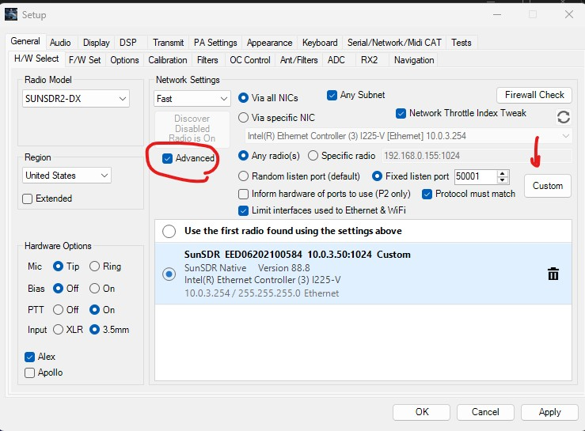
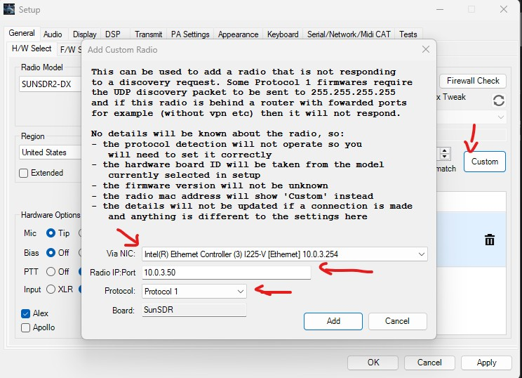
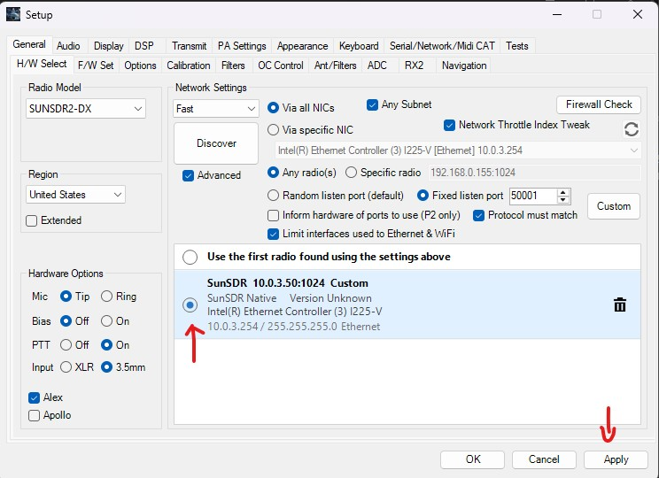

# Start Here: SunSDR2 DX Setup In ArtemisSDR

This guide is the shortest reliable path to get a SunSDR2 DX working in this ArtemisSDR fork.

## Before You Start

You need:

- a working SunSDR2 DX on the network
- ArtemisSDR built from this SunSDR-enabled fork
- a Windows audio path you intend to use
  - ASIO if available
  - or VAC if you prefer that workflow

Recommended:

- put the PC and the radio on the same local subnet
- use wired Ethernet while bringing the radio up the first time

## 1. Start ArtemisSDR

Launch ArtemisSDR and open:

- `Setup`

## 2. Select The Radio Model

In ArtemisSDR, set the hardware model to:

- `SunSDR2DX`

If ArtemisSDR was previously configured for another radio, close and reopen it after changing the model.

## 3. Open The Hardware Network Page And Add Your Radio Manually

> **Important:** the SunSDR2 DX does **not** respond to ArtemisSDR's broadcast discovery (`Discover` is intentionally disabled in this fork — you'll see the greyed-out *"Discover Disabled / Radio is On"* badge in the screenshot below). You must add the radio **manually** by IP address. This is the single most common point of confusion for new users — please follow these steps in order.

Go to: `Setup -> H/W Select`

### Step 3a — Enable Advanced and open Add Custom Radio

1. Confirm `Radio Model` is `SUNSDR2-DX` (top-left).
2. Tick the **`Advanced`** checkbox (red circle in the screenshot).
3. Click the **`Custom`** button on the right (red arrow).

*Setup → H/W Select. Tick `Advanced`, then click `Custom` to open the Add Custom Radio dialog. Once added, your radio shows up as a `Custom` entry like the green-highlighted `SunSDR EED…` row above.*

### Step 3b — Fill in the Add Custom Radio dialog

The Add Custom Radio dialog opens. Fill in the four fields:

| Field | Value | Notes |
|---|---|---|
| **Via NIC** | **The LAN adapter that is on the same subnet as your radio** | This is critical — see the call-out below. |
| **Radio IP:Port** | `<your radio's IP>` (e.g. `10.0.3.50`) | Only the IP — port `1024` is the default and is appended automatically. Find your radio's IP from your router, your old ExpertSDR config, or by pinging the radio if you know the address. |
| **Protocol** | `Protocol 1` | Leave at default. |
| **Board** | `SunSDR` | Leave at default. |

> **⚠️ Pick the right Via NIC.** If you have multiple network interfaces (Wi-Fi + Ethernet, dual NICs, virtual adapters from VPNs / Hyper-V / VMware / WSL2, etc.), the dropdown will list all of them. **You must choose the adapter whose IP is on the same subnet as the radio.** For example: if the radio is at `10.0.3.50`, pick the NIC with an IP like `10.0.3.x`. Picking the wrong NIC is the #1 reason connection fails after a manual Custom add. The screenshot above shows `Intel(R) Ethernet Controller (3) I225-V [Ethernet] 10.0.3.254` as the selected NIC — same `10.0.3.x` subnet as the radio's `10.0.3.50`. If your dropdown shows `0.0.0.0` for an NIC, that NIC is unconfigured and won't work.

Click **`Add`**. The dialog closes and the new radio appears back on the H/W Select page as a `Custom` entry in the radio list.

### Step 3c — Select the radio and Apply

You're now back on the main H/W Select page. The new radio is in the list but **not yet selected**. Two more clicks:

1. **Click the radio button** to the left of the SunSDR row (top red arrow in the screenshot above) so the row gets highlighted/selected.
2. **Click `Apply`** at the bottom-right of the Setup window (bottom red arrow).

At this point the radio shows in the list with `Version Unknown` — that's normal for a not-yet-powered-on connection. The version populates after Power-on in the next step.

## 4. Click OK And Power On

1. Click **`OK`** at the bottom of the Setup window to close it.
2. Back on the main ArtemisSDR window, click the **Power** button (top-left, the round icon next to `RX2`).
3. The connection handshake runs. On success:
   - the panadapter starts moving and you should hear receive audio
   - the `H/W Select` row (and the title bar at the top of the ArtemisSDR window) refreshes to show the live firmware version and serial, e.g. `(FW 88.8 SunSDR Native SN EED06202100584)`

If the title bar still shows `FW Unknown` after Power-on or the radio doesn't connect:

- re-open `Setup → H/W Select` and double-check your **Via NIC** is the adapter on the same subnet as the radio
- confirm you can reach the radio from a command prompt: `ping <your-radio-IP>`
- make sure no other ExpertSDR / Thetis / SDR client is running anywhere on the LAN — the SunSDR2 DX's control port is exclusive

## 5. Power The Radio On

Use the normal ArtemisSDR `Power` control.

On a good connection:

- the panadapter should start
- receive audio should come up
- the title bar should show the SunSDR firmware and serial

## 6. Verify Basic Receive

Check these first:

- tune RX1 and confirm panadapter movement
- confirm band changes work
- if you use RX2, enable it and confirm VFO B activity

## 7. Verify Basic Transmit

Before transmitting into a real load/antenna:

- set a safe power level
- use a dummy load if possible
- verify your PTT path and mic/VAC routing

Then test:

- `MOX`
- `TUNE`

## 8. Make The xPA Button Appear

The main-window `xPA` button does **not** appear automatically just because the SunSDR supports PA control.

You must enable at least one external PA transmit pin in:

- `Setup -> OC Control -> HF/VHF/SWL -> Ext PA Control (xPA)`

Minimum working setup:

1. Enable one `TXPA` output pin
2. Set `Transmit Pin Action` to `Mox/Tune/2Tone`
3. Apply the change

After that, the `xPA` button should appear in the main ArtemisSDR UI.

What it means:

- `xPA` is the ArtemisSDR UI gate for external/PA control
- on this SunSDR fork, that UI state now drives the native SunSDR PA control path

## 9. Initial Power Calibration

Do not trust the on-screen TX power meter as the source of truth for SunSDR yet.

For initial calibration:

- use an external wattmeter
- start at low drive
- verify output on each band you care about

The main ArtemisSDR controls that matter are:

- `Drive`
- `Tune`
- `PA Gain By Band`
- band `Offset`
- `Actual Power @ 100% slider`

## 10. If The Radio Is Found But Audio Is Wrong

Check:

- your selected Windows audio device / ASIO device
- VAC configuration if you rely on VAC
- RX sample rate / audio routing settings

For first bring-up, keep the setup simple:

- one receiver
- no diversity
- no unusual VAC chains

## 11. If xPA Does Not Show

Check all of these:

- you are running the `SunSDR2DX` hardware model
- you enabled at least one `TXPA` pin under `Ext PA Control (xPA)`
- the pin action is set to `Mox/Tune/2Tone`
- you applied the setting

If needed:

- close and reopen `Setup`
- power-cycle the radio connection once

## 12. If The Radio Connects But You Do Not See FW/SN

Check:

- you are on this SunSDR-enabled fork
- the radio actually connected
- the top bar and `H/W Select` row refreshed after connect

The live values currently come from the SunSDR native control path during connect, not from static settings.

## Known Current Limits

- diversity is not currently supported on SunSDR2 DX in this fork
- the displayed TX wattmeter is not yet authoritative for SunSDR calibration
- RX band switching works, but the current implementation still uses a SunSDR-specific recovery path behind the scenes
- intermittent raspy TUNE/MOX TX is a known polish item; cycling VAC (Enable VAC off/on from the sidebar) clears it

## Quick Checklist

1. Set hardware model to `SUNSDR2-DX`
2. Open `Setup -> H/W Select`
3. **Tick `Advanced`** (auto-discovery does not work for SunSDR2 DX — manual add is required)
4. Click **`Custom`** → fill in **Via NIC** (the LAN adapter on the radio's subnet) and **Radio IP:Port** (e.g. `10.0.3.50`) → leave Protocol/Board at defaults → click `Add`
5. Back on H/W Select: click the **radio button** next to the new `Custom` entry, then click `Apply`, then `OK`
6. Click **Power** in the main ArtemisSDR window — the radio row + title bar should refresh with live `FW` and `SN`
7. Confirm panadapter and audio
8. Enable `xPA` via `Setup -> OC Control -> HF/VHF/SWL -> Ext PA Control (xPA)`
9. Calibrate output with an external wattmeter
